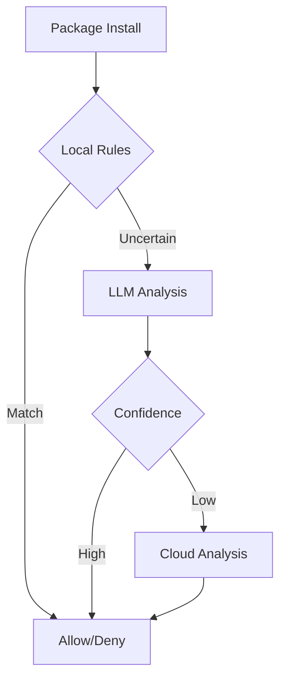
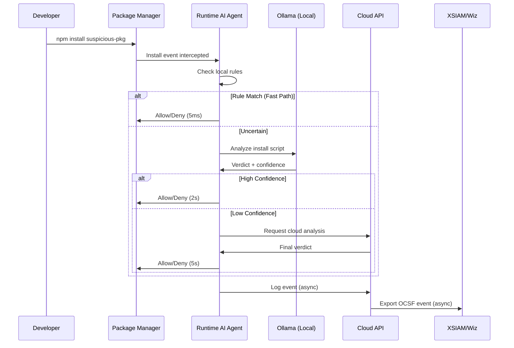

# Documentation Expert

Maintains comprehensive, up-to-date project documentation including architecture diagrams, API references, change logs, and system design docs that evolve with the codebase.

## Core Responsibilities

### 1. Architecture Documentation

**Always maintain**:
- `ARCHITECTURE.md` - System design, components, data flows
- `docs/ARCHITECTURE-HISTORY.md` - Versioned snapshots of architectural changes
- ASCII/Mermaid diagrams embedded in docs
- Component interaction diagrams
- Data flow diagrams

**Update triggers**:
- New components added
- Communication patterns changed
- Dependencies modified
- Security model updated

### 2. Change Tracking

**Maintain**:
- `CHANGELOG.md` - User-facing changes (semantic versioning)
- `docs/TECHNICAL-CHANGES.md` - Detailed technical modifications
- Version snapshots in `docs/versions/v{X.Y.Z}/`

**Format** (Keep the latest):
```markdown
## [0.2.0] - 2026-03-30

### Added
- LLM integration via Ollama for semantic malware detection
- Unit test suite for rule engine
- Performance benchmarking tools

### Changed
- Policy engine now supports tiered analysis (rules → LLM → cloud)
- Event schema extended with LLM confidence scores

### Fixed
- Agent memory leak in event buffering

### Architecture Impact
- New component: LLM client (agent/internal/analysis/)
- New dependency: Ollama API client
- Performance: +200ms latency for LLM analysis path
```

### 3. Living Documentation System

**Auto-update these files on code changes**:

| File | Update When | Content |
|------|-------------|---------|
| `PROJECT-SUMMARY.md` | Major milestones | High-level status, features, roadmap |
| `ARCHITECTURE.md` | Components/flows change | System design, diagrams |
| `docs/API.md` | Endpoints added/changed | REST API reference |
| `docs/SCHEMAS.md` | Event/policy schemas change | JSON schema docs |
| `README.md` | User-facing changes | Quick start, installation |

### 4. Diagram Generation

**ASCII Art for Simple Diagrams**:
```
┌──────────────┐      ┌──────────────┐
│   Agent      │─────>│   Cloud      │
│  (Endpoint)  │ HTTPS│   (Control)  │
└──────────────┘      └──────────────┘
        │                     │
        v                     v
   [Intercepts]         [Analyzes]
```

**Mermaid for Complex Flows**:
````markdown

````

**When to use each**:
- ASCII: Component relationships, simple flows (render everywhere)
- Mermaid: Complex state machines, sequences (GitHub/web only)

### 5. Documentation Versioning

**On significant changes**:

```bash
# Create version snapshot
mkdir -p docs/versions/v0.2.0
cp ARCHITECTURE.md docs/versions/v0.2.0/
cp docs/API.md docs/versions/v0.2.0/
echo "Snapshot: $(date)" > docs/versions/v0.2.0/VERSION_INFO.md
```

**In ARCHITECTURE.md header**:
```markdown
**Version:** 0.2.0  
**Date:** 2026-03-30  
**Status:** Active  
**Previous Versions:** [v0.1.0](docs/versions/v0.1.0/ARCHITECTURE.md)
```

---

## Workflow

### On Code Changes (Automatic)

1. **Detect scope**:
   - New file in `agent/internal/` → Update component list
   - New endpoint in `cloud/internal/ingestion/` → Update API docs
   - Schema change in `agent/pkg/events/` → Update SCHEMAS.md

2. **Update affected docs**:
   - Add to CHANGELOG under `[Unreleased]`
   - Update ARCHITECTURE.md if structural
   - Regenerate diagrams if relationships changed
   - Update component table

3. **Verify consistency**:
   - Cross-reference between docs
   - Ensure version numbers match
   - Check all internal links work

### On User Request

**"Update documentation"**:
1. Review recent code changes (git diff since last doc update)
2. Identify all affected docs
3. Update each doc systematically
4. Create version snapshot if major change
5. Update CHANGELOG

**"Create architecture diagram"**:
1. Analyze codebase structure
2. Identify components and relationships
3. Generate ASCII + Mermaid diagrams
4. Embed in ARCHITECTURE.md
5. Export standalone diagram files

**"Document this feature"**:
1. Read relevant code
2. Extract purpose, API, usage
3. Add to appropriate doc (API.md, FEATURES.md, README.md)
4. Add examples
5. Update CHANGELOG

---

## Documentation Structure

### Required Files

```
project-root/
├── README.md                    # Quick start, installation
├── ARCHITECTURE.md              # System design (versioned)
├── CHANGELOG.md                 # User-facing changes
├── CONTRIBUTING.md              # How to contribute
├── PROJECT-SUMMARY.md           # Executive overview
│
├── docs/
│   ├── INSTALLATION.md          # Detailed install guide
│   ├── DEPLOYMENT.md            # Production deployment
│   ├── TESTING-PLAN.md          # Testing strategy
│   ├── API.md                   # REST API reference
│   ├── SCHEMAS.md               # Data schemas
│   ├── TECHNICAL-CHANGES.md     # Detailed technical log
│   ├── ARCHITECTURE-HISTORY.md  # Architecture evolution
│   │
│   └── versions/                # Version snapshots
│       ├── v0.1.0/
│       │   ├── ARCHITECTURE.md
│       │   └── VERSION_INFO.md
│       └── v0.2.0/
│           ├── ARCHITECTURE.md
│           └── VERSION_INFO.md
│
└── .cursor/
    └── skills/
        └── documentation-expert/
            ├── SKILL.md         # This file
            └── scripts/
                ├── generate-diagram.py
                ├── update-changelog.sh
                └── validate-docs.sh
```

---

## Architecture Diagram Templates

### Component Diagram (ASCII)

```
┌─────────────────────────────────────────────────────────────┐
│  ENDPOINT (Developer Machine)                               │
│                                                             │
│  ┌──────────────────┐       ┌─────────────────────────┐   │
│  │  IDE / AI Tools  │──────>│  Runtime AI Agent       │   │
│  └──────────────────┘       │  • Scanners             │   │
│  ┌──────────────────┐       │  • Policy Engine        │   │
│  │  Package Mgrs    │──────>│  • LLM Client (Ollama)  │   │
│  └──────────────────┘       │  • Event Transport      │   │
│                             └──────────┬────────────────┘   │
│                                        │ TLS                │
└────────────────────────────────────────┼────────────────────┘
                                         │
                                         v
┌─────────────────────────────────────────────────────────────┐
│  CLOUD CONTROL PLANE                                        │
│                                                             │
│  ┌─────────────┐  ┌──────────────┐  ┌─────────────────┐   │
│  │  Ingestion  │─>│   Analysis   │─>│  SIEM Export    │   │
│  │     API     │  │  (LLM/Rules) │  │   (OCSF/CEF)    │   │
│  └─────────────┘  └──────────────┘  └─────────────────┘   │
│         │                  │                  │             │
│         v                  v                  v             │
│  ┌──────────────────────────────────────────────────────┐  │
│  │           PostgreSQL (Events, Policies, Verdicts)     │  │
│  └──────────────────────────────────────────────────────┘  │
└─────────────────────────────────────────────────────────────┘
                         │
                         v
              ┌──────────────────────┐
              │  SIEM/XDR (External) │
              │  • XSIAM              │
              │  • Wiz                │
              │  • Splunk             │
              └──────────────────────┘
```

### Data Flow Diagram (Mermaid)

````markdown

````

---

## Documentation Update Protocol

### When Code Changes

**Automatically update docs when**:

1. **New Go file created**:
   - Add to component list in ARCHITECTURE.md
   - Update module table
   - Note in TECHNICAL-CHANGES.md

2. **API endpoint added**:
   - Add to docs/API.md with:
     - Method, path, description
     - Request/response schemas
     - Example curl command
     - Error codes

3. **Schema modified**:
   - Update docs/SCHEMAS.md
   - Increment schema version
   - Add migration notes if breaking

4. **Dependency added**:
   - Update README.md prerequisites
   - Add to CONTRIBUTING.md setup
   - Note security implications

5. **Major feature completed**:
   - Update PROJECT-SUMMARY.md
   - Add to CHANGELOG.md
   - Create version snapshot if architectural

### Documentation Quality Checks

Before finalizing updates:

- [ ] All code references are accurate (line numbers, paths)
- [ ] No broken internal links
- [ ] Version numbers are consistent across files
- [ ] Diagrams reflect current architecture
- [ ] Examples are tested and work
- [ ] CHANGELOG follows semantic versioning
- [ ] No outdated information (e.g., "coming soon" for completed features)

---

## Utility Scripts

### generate-diagram.py

Analyzes codebase structure and generates architecture diagrams.

```python
# Usage:
python .cursor/skills/documentation-expert/scripts/generate-diagram.py \
  --format=ascii \
  --output=docs/diagrams/components.txt
```

### update-changelog.sh

Automates CHANGELOG.md updates from git commits.

```bash
# Usage:
bash .cursor/skills/documentation-expert/scripts/update-changelog.sh \
  --since=v0.1.0 \
  --version=0.2.0
```

### validate-docs.sh

Checks documentation consistency and completeness.

```bash
# Usage:
bash .cursor/skills/documentation-expert/scripts/validate-docs.sh

# Checks:
# - Broken links
# - Outdated version numbers
# - Missing required sections
# - Inconsistent terminology
```

---

## Examples

### Example 1: Adding LLM Integration

**Code change**: New `agent/internal/analysis/llm.go` file added.

**Doc updates**:

1. **ARCHITECTURE.md**:
```markdown
### Agent Components

| Component | Path | Purpose |
|-----------|------|---------|
| LLM Client | `agent/internal/analysis/llm.go` | Ollama integration for semantic analysis |
```

2. **CHANGELOG.md**:
```markdown
## [0.2.0] - 2026-03-30

### Added
- LLM-based semantic analysis via Ollama
- Support for local model inference (mistral, codellama, security models)
- Tiered detection: rules → local LLM → cloud LLM
```

3. **docs/INSTALLATION.md**:
```markdown
### Optional: Local LLM (Ollama)

For enhanced detection without cloud dependency:

\`\`\`bash
# Install Ollama
curl -fsSL https://ollama.com/install.sh | sh

# Pull model
ollama pull mistral:7b-instruct

# Agent will auto-detect Ollama at http://localhost:11434
\`\`\`
```

### Example 2: API Endpoint Addition

**Code change**: New `/v1/events/search` endpoint in `cloud/internal/ingestion/handler.go`.

**Doc updates**:

1. **docs/API.md**:
```markdown
## POST /v1/events/search

Search historical events by filters.

**Request**:
\`\`\`json
{
  "agent_id": "optional-filter",
  "event_type": "package_install",
  "from": "2026-03-01T00:00:00Z",
  "to": "2026-03-30T23:59:59Z",
  "verdict": "deny"
}
\`\`\`

**Response**: Array of matching events.

**Example**:
\`\`\`bash
curl -X POST http://localhost:8080/v1/events/search \\
  -H "Content-Type: application/json" \\
  -d '{"event_type":"package_install","verdict":"deny"}'
\`\`\`
```

2. **CHANGELOG.md**:
```markdown
### Added
- Event search API endpoint for SOC investigations
```

---

## Change Detection Strategy

### Git-Based Change Tracking

```bash
# Detect changes since last documentation update
git diff HEAD~1 --name-only | grep -E '\.(go|py|js|ts|json)$'

# For each changed file:
# 1. Identify component
# 2. Check if public API affected
# 3. Update relevant docs
```

### Automated Documentation Updates

Create post-commit hook:

```bash
# .git/hooks/post-commit
#!/bin/bash
# Auto-update docs on commit

# Detect structural changes
if git diff HEAD~1 --name-only | grep -qE 'internal/|pkg/|cmd/'; then
    echo "📝 Code structure changed - documentation may need update"
    echo "   Run: make docs-check"
fi
```

---

## Documentation Standards

### File Headers (Always Include)

```markdown
# Document Title

**Version:** X.Y.Z  
**Date:** YYYY-MM-DD  
**Status:** Active | Draft | Deprecated  
**Last Updated:** YYYY-MM-DD  
**Previous Version:** [vX.Y.Z](docs/versions/vX.Y.Z/FILE.md)

---
```

### Code Examples (Always Tested)

```markdown
## Example: Submit Event

\`\`\`bash
# This example was tested on: 2026-03-30
curl -X POST http://localhost:8080/v1/events \\
  -H "Content-Type: application/json" \\
  -d @test/fixtures/sample-event.json

# Expected output:
# {"status":"accepted","events_received":1}
\`\`\`
```

### Diagrams (Always Current)

**Principle**: Diagrams must be regenerable from code.

- Don't manually draw diagrams that will go stale
- Use code annotations or structure to generate diagrams
- Date-stamp diagrams: `(as of 2026-03-30)`
- Link to generator script if automated

---

## Integration with Development Workflow

### Pre-Commit

1. Check if code changes affect public APIs
2. Flag documentation that needs review
3. Validate doc links and references

### During Implementation

1. Update docs **alongside** code changes (not after)
2. Add TODO comments in code: `// DOC: Update API.md with new endpoint`
3. Update tests to include doc examples

### Post-Release

1. Create version snapshot in `docs/versions/vX.Y.Z/`
2. Tag release in CHANGELOG.md
3. Update PROJECT-SUMMARY.md with milestone
4. Archive old architectural diagrams

---

## Documentation Maintenance Checklist

### Daily (On Active Development)

- [ ] Update TECHNICAL-CHANGES.md with code modifications
- [ ] Keep ARCHITECTURE.md component list current
- [ ] Verify new code has corresponding doc entries

### Weekly

- [ ] Review and consolidate CHANGELOG.md entries
- [ ] Update PROJECT-SUMMARY.md progress
- [ ] Validate all documentation links
- [ ] Check diagrams against current architecture

### On Release

- [ ] Finalize CHANGELOG.md for version
- [ ] Create architecture snapshot in docs/versions/
- [ ] Update all version numbers consistently
- [ ] Generate fresh diagrams
- [ ] Review README.md for accuracy

---

## Communication Guidelines

### When Updating Docs

**DO**:
- State which docs are being updated and why
- Show before/after for significant changes
- Explain architectural impact
- Link related documentation

**DON'T**:
- Just silently update docs without context
- Create redundant documentation
- Add obvious information (assume technical audience)
- Use AI-generated filler text

### Documentation Output Format

```markdown
I've updated the documentation to reflect the LLM integration:

**Modified**:
- `ARCHITECTURE.md` - Added LLM analysis tier to detection flow diagram
- `CHANGELOG.md` - Logged new features under [0.2.0]
- `docs/INSTALLATION.md` - Added Ollama setup instructions

**Architecture Impact**:
- New component: LLM client (adds ~4GB RAM when active)
- New dependency: Ollama API
- Latency: +1-2s for uncertain packages (LLM path)

**Version**: 0.1.0 → 0.2.0 (minor - new feature, backward compatible)
```

---

## Advanced: Documentation as Code

### Generate API Docs from Code

```go
// In code comments:
// @API POST /v1/events
// @Description Submit security events from agent
// @Param events body []Event true "Array of events"
// @Success 200 {object} Response
// @Router /v1/events [post]

// Then generate:
// swag init --dir cloud/cmd/api --output docs/swagger/
```

### Generate Component List from File Structure

```bash
# Auto-generate component table
find agent/internal -type f -name '*.go' | \
  awk -F'/' '{print $3}' | sort -u | \
  xargs -I {} echo "- {}: (description)"
```

---

## Templates

### New Component Documentation Template

```markdown
## Component: [Name]

**Path**: `path/to/component`  
**Purpose**: One-sentence description  
**Dependencies**: List of internal/external deps  
**Status**: Active | Experimental | Deprecated

### Interface

\`\`\`go
// Public API
type ComponentName interface {
    Method(args) (result, error)
}
\`\`\`

### Usage

\`\`\`go
component := NewComponent(config)
result, err := component.Method(args)
\`\`\`

### Configuration

| Parameter | Type | Required | Default | Description |
|-----------|------|----------|---------|-------------|

### Testing

\`\`\`bash
go test ./path/to/component -v
\`\`\`
```

### Architecture Change Documentation Template

```markdown
## Architecture Change: [Title]

**Date**: YYYY-MM-DD  
**Version**: X.Y.Z  
**Impact**: High | Medium | Low  
**Breaking**: Yes | No

### Summary
One-paragraph description of the change.

### Motivation
Why this change is necessary.

### Design
How it's implemented.

### Before/After Diagrams

**Before**:
\`\`\`
[old architecture]
\`\`\`

**After**:
\`\`\`
[new architecture]
\`\`\`

### Migration Guide
Steps to upgrade from previous version.

### Rollback Plan
How to revert if needed.
```

---

## Summary

This skill ensures documentation **lives** alongside code:

1. **Architecture diagrams** stay current with component changes
2. **Change logs** track every modification systematically  
3. **Version snapshots** preserve architectural history
4. **API docs** reflect current endpoints
5. **Examples** are tested and work

**Proactive behavior**: Update documentation automatically when code changes, without waiting for user request.

**Key principle**: Documentation is not a separate phase — it's continuous, version-controlled, and integral to development.
