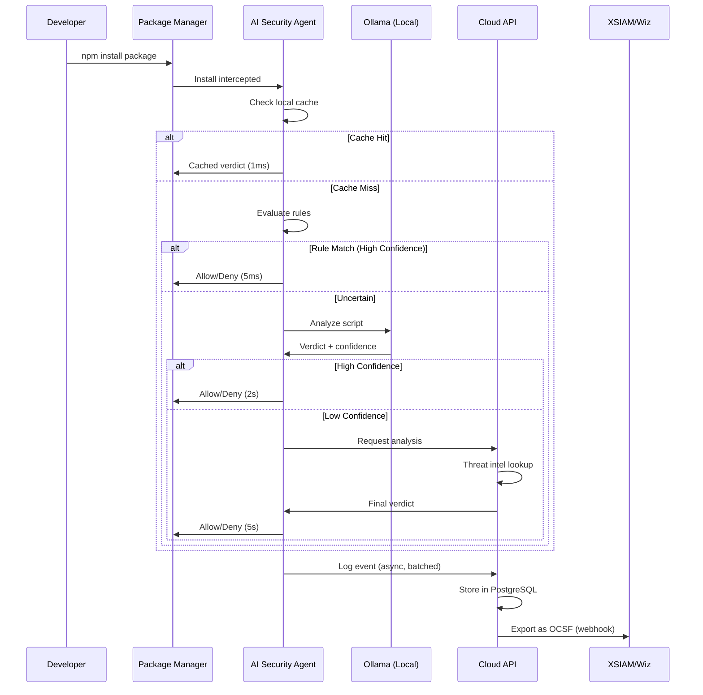

# Runtime AI Security Platform - Architecture

**Generated**: 2026-03-30 17:33
**LLM Integration**: Not yet implemented

## System Architecture

┌─────────────────────────────────────────────────────────────┐
│  ENDPOINT (Developer Machine)                               │
│                                                             │
│  ┌──────────────────┐       ┌─────────────────────────┐   │
│  │  IDE / AI Tools  │──────>│  Runtime AI Agent       │   │
│  └──────────────────┘       │  • Scanners             │   │
│  ┌──────────────────┐       │  • Policy Engine        │   │
│  │  Package Mgrs    │──────>│  • Event Transport      │   │
│  └──────────────────┘       └──────────┬──────────────┘   │
│                                        │ TLS              │
└────────────────────────────────────────┼──────────────────┘
                                         │
                                         v
┌─────────────────────────────────────────────────────────────┐
│  CLOUD CONTROL PLANE                                        │
│                                                             │
│  ┌─────────────┐  ┌──────────────┐  ┌─────────────────┐   │
│  │  Ingestion  │─>│   Analysis   │─>│  SIEM Export    │   │
│  │     API     │  │  (Rules)     │  │   (OCSF/CEF)    │   │
│  └─────────────┘  └──────────────┘  └─────────────────┘   │
│         │                  │                  │             │
│         v                  v                  v             │
│  ┌──────────────────────────────────────────────────────┐  │
│  │           PostgreSQL (Events, Policies, Verdicts)     │  │
│  └──────────────────────────────────────────────────────┘  │
└─────────────────────────────────────────────────────────────┘
                         │
                         v
              ┌──────────────────────┐
              │  SIEM/XDR (External) │
              │  • XSIAM              │
              │  • Wiz                │
              │  • Splunk             │
              └──────────────────────┘

## Event Flow

## Component Map

### Agent Components

| Component | Files | Purpose |
|-----------|-------|---------|
| internal | 6 | *Auto-detected* |
| pkg | 3 | *Auto-detected* |

### Cloud Components

| Component | Files | Purpose |
|-----------|-------|---------|
| internal | 3 | *Auto-detected* |
| pkg | 2 | *Auto-detected* |

## Project Statistics

- **Go files**: 18
- **Detection rules**: 1
- **Documentation files**: 12

---
*Generated by documentation-expert skill*
